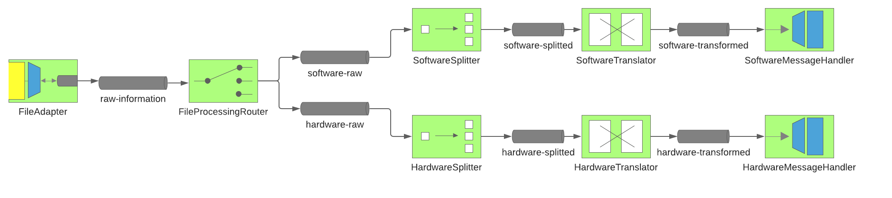

# VEHICLE FEATURE APPLICATION

This project contains the representation of an application responsible for exposing/processing information about vehicles features.

### File Processing Flow

See below how the vehicle information's flow process happens. 



## RUNNING IN DOCKER

These instructions will get you the project up and running in a Docker container for testing purposes.

It will download the application image from [docker registry](https://hub.docker.com/r/williamcustodio/vehicle-feature) and configure the database.

### PREREQUISITES

What things you need to run the application:

```
Docker
```

#### INSTALLING

##### DOCKER

Download the [wizard](https://docs.docker.com/get-docker/) and follow the instructions to install it.

### RUNNING

Change the tags `<input_host_directory>`, `<input_directory_name>`, `<output_directory_name>` and `<error_directory_name>` at [docker-compose.yaml](./docker-compose.yaml) to match the place where the vehicles files should be taken.

Run the application with the following command inside of the [root folder](.):

```
 docker-compose up
```

## RUNNING IN DEVELOPMENT MODE

These instructions will get you a copy of the project up and running on your local machine for development and testing purposes.

### PREREQUISITES

What things you need to install the application and how to install them:

```
Java 11
Maven 3.6.3
Docker
```
#### INSTALLING

Install the tool for managing parallel versions of multiple Software Development Kits [SDK MAN](https://sdkman.io/install).

##### JAVA

Execute the following command:

```
sdk install java 11.0.8-amzn
```

##### MAVEN

Execute the following command:

```
sdk install maven 3.6.3
```

##### DOCKER

Download the [wizard](https://docs.docker.com/get-docker/) and follow the instructions to install it.

### RUNNING WITH MAVEN

Create an instance of MySQL using the following command:

```
 docker run -e MYSQL_ROOT_PASSWORD=<root_password> -e MYSQL_DATABASE=<database> -e MYSQL_USER=v<username> -e MYSQL_PASSWORD=<password> -p 3306:3306 mysql
```

Run the application with the following command inside the [root folder](.):

```
 mvn spring-boot:run -Dspring-boot.run.profiles=vehicle-data-flow -Dspring-boot.run.jvmArguments="-DDATA_SOURCE_URL=jdbc:mysql://localhost:3306/<database> -DDATA_SOURCE_USERNAME=<username> -DDATA_SOURCE_PASSWORD=<password> -DFILE_PROCESSING_INPUT_DIR=<input_directory_name> -DFILE_PROCESSING_OUTPUT_DIR=<output_directory_name> -DFILE_PROCESSING_ERROR_DIR=<error_directory_name>"
```

## TESTING

### API

1. Access the [api documentation](http://localhost:8080/swagger-ui.html).
2. Perform tests using the defined requests.

### File processing

1. Insert the files to be processed inside the `<input_directory_name>` folder defined by the RUNNING section.
2. Watch the application logs to see if the files are being processed, a message should be shown. E.g: Reading vehicle software information VehicleSoftware(vin=3C3CFFER4ET929645, code=Cd9t6T).